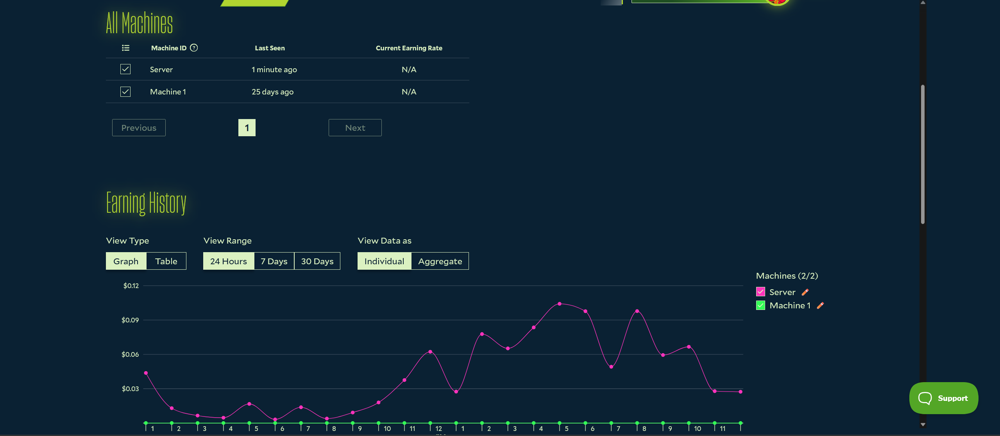

# Salad's Machine Renamer
> First and foremost, welcome traveller!

Salad's earning page still only displays the machine ID, and provides Chefs with no method to manually customize these machine IDs.

Our project aims to alleviate this issue by providing a simple, intuitive and functional solution.



## Installing / Getting started :beginner:

There are 2 main ways for you to install the extension:
- Use the Firefox Extension marketplace (more marketplaces are being worked on)
- Use from source

##### Installing from the Firefox Extension marketplace

- In the top right of firefox, click the puzzle icon, then "Manage extensions"
- Scroll to the bottom and click on "Find more add-ons"
- In the search bar, look for `Salad's Machine Renamer`
- Or use the direct link : https://addons.mozilla.org/en-US/firefox/addon/salads-machine-renamer/
- Click "Add to Firefox"

##### Installing from source

- Coming soon!

## Permissions & Security :lock:

Web extensions can be dangerous, this is why we wanted to let you know the things the extension can and can't do, as well as what we do with page information.
- Salad's Machine Renamer **does not**:
  - Access, edit, or delete any of your Salad Account information (and it can't)
  - Collect information on pages you visit, content viewed, or any other browser information
  - Use any personally identifiable information 
  - Access the internet
  - Change your browser or machine's settings
  - Interact with other web pages
‎
- Salad's Machine Renamer **does**:
  - Locally store (within your browser) the original machine ID, the new name you have set
  - Change the _web content_ you see to reflect your changed machine name
  - Only attempt to load the script on pages matching this URL pattern `http(s)://salad.com/earn/*`

>Note: this project is under development. We will abide by the definitions above, but cannot guarantee this won't change in the future.

> Note: we cannot guarantee the stability of the project, or that it will work at all times. The extension provides its best effort at completing its objective.

## Features 👍

This project was mainly created to allow users to manually customize their machine names and provide persistent support for them.

As of today, here are the available features:
- Rename a machine ID to a custom name on your browser
- See references to this machine ID be renamed to your custom text on the earn pages
- Set once, keep forever - we store your selection locally to automatically update the values even when you reload the page!

## Contributing :heart:

Do you like this project and want to contribute to it? Suggestions, fixes, and comments are welcome!

In order to contribute, please open an issue and provide detail about your comment using the following format:

- Title:
```bash
[bug|suggestion|comment] A summarized description of your issue
```
Pick one between bug, suggestion, or comment.

- Content:
```bash
[Version] : Add your version here
[Observed] : Explain what behavior you are seeing when using the extension
[Expected] : Explain what you were expecting to happen
[Attempted] : Have you attempted any debugging steps? Has anything worked?
[Additional] : Anything else that can help us?
```
Try to fill in all fields to give us context! You can omit tags that don't apply, for example `Attempted` in the case of a `suggestion` might not be required.

**Are you more technically inclined?**<br>
If you're comfortable with JavaScript / Web Development / Extension Development, you're welcome to directly submit a pull request.

Make sure to include all relevant information about what the request aims to achieve, actually does, or anything relevant for our review. We may contact you if more information is required.

## Salad? Machine IDs? :link:

Salad is a distributed Cloud computing platform - users can earn balance by contributing their machine's computing power to our paying customers.<br>
Learn more here: https://salad.com/

Machine IDs are unique identifiers for a machine on the network. Salad has not implemented a method to use custom names on these machine IDs, thus this project :smile:!<br>
https://salad.com/store

## Licensing :scroll:

This project and its code is protected by a GPL-3.0 license. You can find a text version of this license in this repository under the LICENSE file, or by using GitHub's "GPL-3.0 license" tab.
